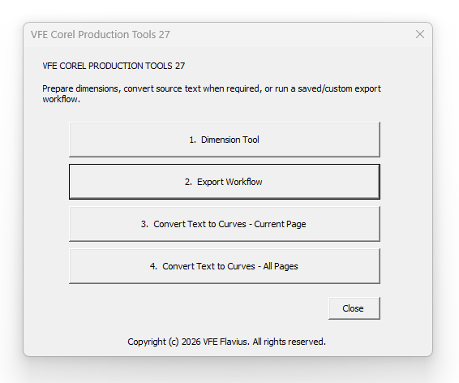
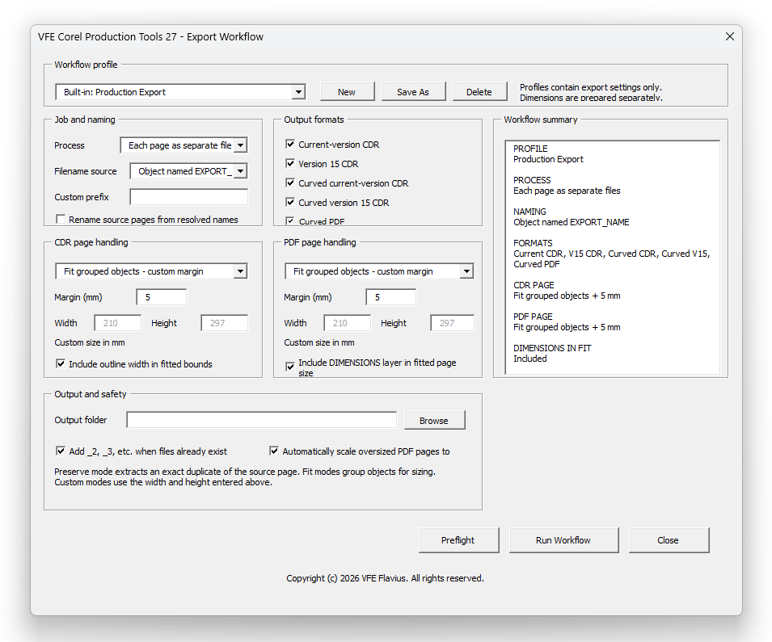

# VFE Corel Production Tools 27

**VFE Corel Production Tools 27** is a VBA/GMS production toolkit for **CorelDRAW version 27 on Windows**.

<p align="center">
  
  
</p>

Copyright (c) 2026 VFE Flavius. All rights reserved.

> This is source-visible proprietary software. It is not open source. Installation and use are allowed under the included licence; modification, redistribution, repackaging, and resale require prior written permission from VFE Flavius.

## Included tools

- **Dimension Tool** — adds editable width and/or height dimensions to each selected object or to the complete selection.
- **Export Workflow** — exports CDR and curved PDF/CDR variants using saved or custom profiles.
- **Current-page text to curves** — converts text recursively, including text inside groups and PowerClips.
- **All-pages text to curves** — performs the same recursive conversion across the document.
- **Page handling** — preserve source page, fit grouped objects with no margin, fit with a custom margin, or use a custom page size.
- **Naming and safety** — supports the `EXPORT_NAME` object, page/document/custom naming, unique filenames, progress, cancellation, and logs.

## Repository layout

```text
VFE-Corel-Production-Tools-27/
├── dist/
│   └── VFE-Corel-Production-Tools-27.gms
├── src/
│   ├── VFE_CorelProductionTools27.bas
│   └── VFE_UI_Installer.bas
├── docs/
├── checksums/
├── .github/
├── INSTALLATION.md
├── BUILD_FROM_SOURCE.md
├── USER_GUIDE.md
├── TROUBLESHOOTING.md
├── LICENSE.md
└── EULA.md
```

## Fast installation

1. Download `dist/VFE-Corel-Production-Tools-27.gms`.
2. In CorelDRAW, open **Tools → Scripts → Scripts**.
3. Select **Visual Basic for Applications**, click **Load**, and choose the `.gms` file.
4. In the Scripts docker, run:

```text
VFE_CorelProductionTools27.VFE_CorelProductionTools27
```

For automatic loading at startup, copy the GMS file to the current user's CorelDRAW `Draw\GMS` folder and restart CorelDRAW. See [INSTALLATION.md](INSTALLATION.md) for detailed instructions.

## Build from source

The source package contains two importable VBA modules. The UI installer is used only while building a new GMS file. It creates the three UserForms, after which it can be removed from the finished GMS.

See [BUILD_FROM_SOURCE.md](BUILD_FROM_SOURCE.md).

## Release status

The GMS file in `dist/` was supplied as a prebuilt CorelDRAW project. Static inspection confirms a valid GMS header and the expected VFE forms/module names. It was not executed or compiled inside CorelDRAW in this packaging environment. Test the release on disposable documents before production use.

The source installer in this repository exposes only:

```text
VFE_InstallVisualInterface
```

The prebuilt GMS may have been created from an earlier installer revision. To guarantee that the binary exactly matches the repository source, rebuild it using [BUILD_FROM_SOURCE.md](BUILD_FROM_SOURCE.md), remove the installer module, compile, save, and publish the rebuilt GMS.

## Important safety notes

- Back up editable CDR files before converting text to curves.
- Test export profiles on non-production documents.
- Check page dimensions, filenames, fonts, colours, and output files before delivery.
- Only load macros from a source you trust.

## Documentation

- [Installation](INSTALLATION.md)
- [Build from source](BUILD_FROM_SOURCE.md)
- [User guide](USER_GUIDE.md)
- [Troubleshooting](TROUBLESHOOTING.md)
- [Architecture](docs/ARCHITECTURE.md)
- [Release checklist](docs/RELEASE_CHECKLIST.md)
- [GitHub publishing](docs/GITHUB_PUBLISHING.md)
- [Official Corel references](docs/OFFICIAL_COREL_REFERENCES.md)

## Licence

Use is governed by the [VFE Proprietary Software License v1.1](LICENSE.md) and [EULA](EULA.md).
